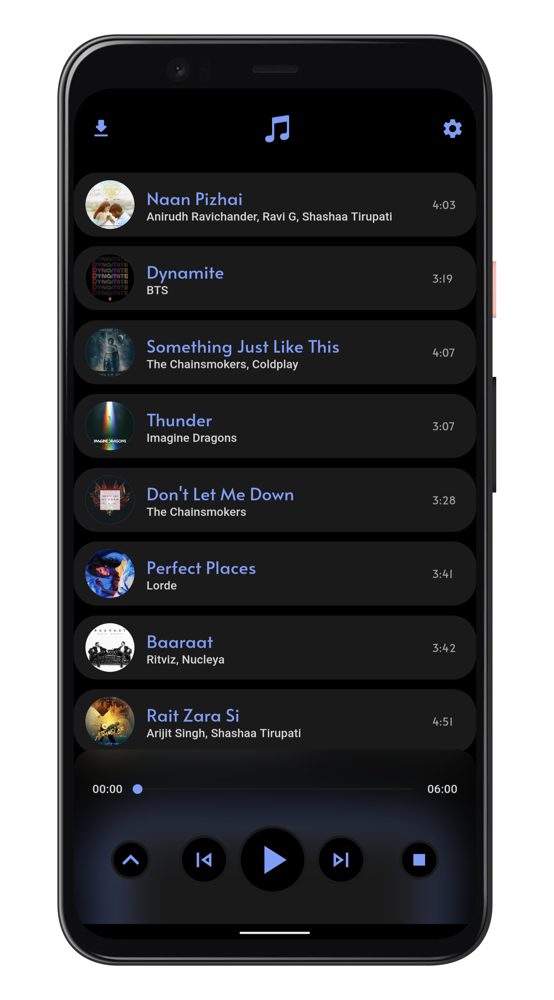
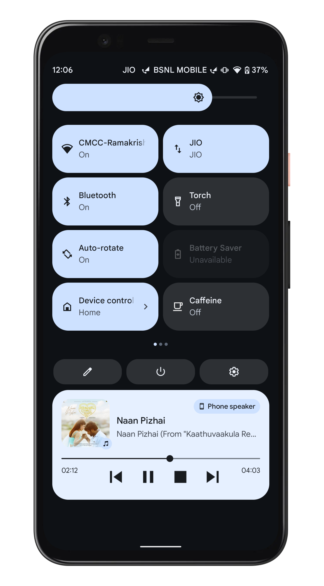
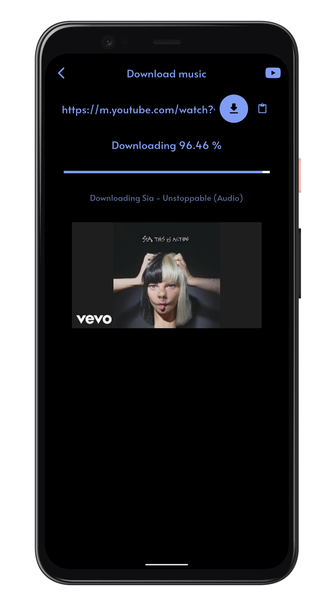

# 

<p align="center"> 
   
   
</p>
<p align="center"> 
   
   
   
   
</p>

<p>
<div align="center">

  <table cellspacing="0" cellpadding="0">
      <tr>
        <td>
          <a href="https://f-droid.org/en/packages/in.amfoss.raag">
          </a>
        </td>
        <td>
          <a href="https://f-droid.org/en/packages/in.amfoss.raag">
          </a>
        </td>
        <td>
          <a href="https://www.buymeacoffee.com/ashwinr"></a>
        </td>
      </tr>
  </table>
 </div> 
</p>

## Features 🧐️
* Download audio from YouTube with the highest possible bitrate  
* Play on-device music files  
* Dark and light themes  
* In-app YouTube browser to search and download your favorite music quickly

## Getting Started 🏃‍♂️️

- These instructions will get you a copy of the project up and be running on your local machine for development and testing purposes.

### Prerequisites ✍️

-  [Android Studio](https://developer.android.com/studio), with a recent version of the Android SDK.
- [Flutter](https://flutter.dev/)
### Setting up your development environment 🏭️

1. Download and install Git.
   
2. Fork [Raag](https://github.com/raag-music/raag.git)
   
3. Clone your fork of the project locally. At the command line:
            
   ```
   $ git clone https://github.com/YOUR-GITHUB-USERNAME/raag.git
   ```

4. Open Raag in your favourite editor (VS Code, Android Studio etc)
   
5. To install the dependencies run the following command in the terminal.

    ```
    $ flutter pub get
    ```

6.  Connect your Android emulator or your mobile device to your computer.
   
7.  Build the application in your device by clicking **Run**  button or run the following in terminal.
    ```
    $ flutter run
    ```


## Screenshots 🤩️
  <table>
      <tr>
       <td></td>
       <td></td>
      </tr>
  </table>
  <table>
       <tr>
       <td></td>
       <td></td>
      </tr>
  </table>


## How to Contribute 🤔
To contribute to this project you can FORK & clone 🍴 the project as mentioned in *Setting up your development environment*, and make an issue on bug fixing or adding new features, and make a PR 😊.

## License 📄️
This project is licensed under the [GPL General Public License v2.0](https://github.com/BolisettySujith/raag/blob/master/LICENSE).


## Resouces 🎓
            
A few resources to get you started if this is your first Flutter project:

- [Lab: Write your first Flutter app](https://flutter.dev/docs/get-started/codelab)
- [Cookbook: Useful Flutter samples](https://flutter.dev/docs/cookbook)

For help getting started with Flutter, view the [online documentation](https://flutter.dev/docs), which offers tutorials,
samples, guidance on mobile development, and a full API reference.


- Icon source: <a target="_blank" href="https://icons8.com/icons/set/musical-notes">Musical Notes icon</a> icon by <a target="_blank" href="https://icons8.com">Icons8</a>
